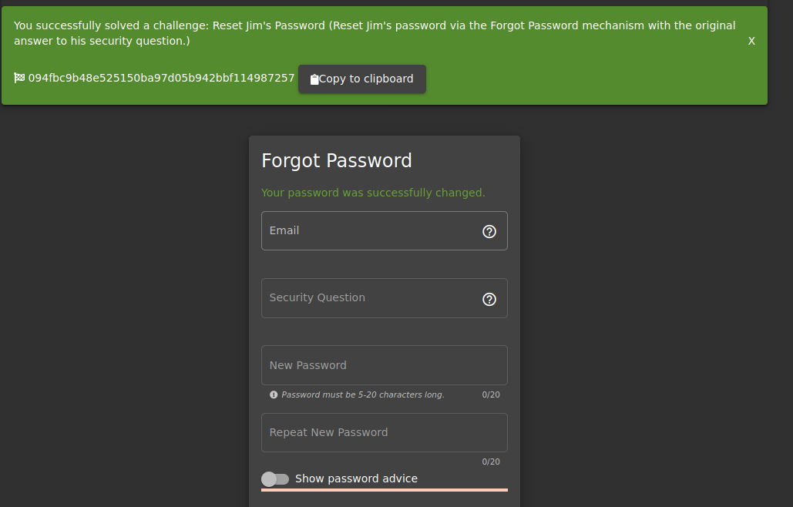
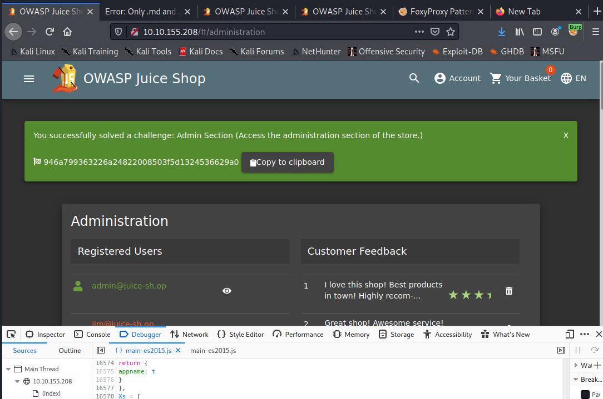

# TryHackMe
  https://tryhackme.com/room/owaspjuiceshop
  


# Task 1  Open for business!
Deploy the VM attached to this task to get started! You can access this machine by using your browser-based machine, or if you're connected through OpenVPN.

Machine IP```10.2.70.52```
Attack Machine```10.10.155.208```

Once the machine has loaded, access it by copying and pasting its IP into your browser; if you're using the browser-based machine, paste the machines IP into a browser on that machine.

# Task 2  Let's go on an adventure!
Question #1: What's the Administrator's email address?

Answer-```admin@juice-sh.op```

Question #2: What parameter is used for searching? 

Answer-```q```

Question #3: What show does Jim reference in his review? 

Answer-```Star Trek```

# Task 3  Inject the juice

Question #1: Log into the administrator account!


     
Answer-``` 32a5e0f21372bcc1000a6088b93b458e41f0e02a```

Question #2: Log into the Bender account!

Similar to what we did in Question #1, we will now log into Bender's account! Capture the login request again, but this time we will put: bender@juice-sh.op'-- as the email. 


Answer-```fb364762a3c102b2db932069c0e6b78e738d4066```

# Task 4  Who broke my lock?!
Question #1: Bruteforce the Administrator account's password!

had to right click to ```send to intruder```

Password-```admin123```


     
Answer-```c2110d06dc6f81c67cd8099ff0ba601241f1ac0e```

Question #2: Reset Jim's password!

OSINT challenge, wiki shows James T. Kirk, brother is ```George Samuel Kirk```

Password-```Samuel```



Answer-```094fbc9b48e525150ba97d05b942bbf114987257```

# Task 5  AH! Don't look!

Question #1: Access the Confidential Document!


Answer-```edf9281222395a1c5fee9b89e32175f1ccf50c5b```

Question #2: Log into MC SafeSearch's account!


Answer-```66bdcffad9e698fd534003fbb3cc7e2b7b55d7f0```

Question #3: Download the Backup file!


     
Answer-```bfc1e6b4a16579e85e06fee4c36ff8c02fb13795```

#Task 6  Who's flying this thing?

Modern-day systems will allow for multiple users to have access to different pages. Administrators most commonly use an administration page to edit, add and remove different elements of a website. You might use these when you are building a website with programs such as Weebly or Wix.  

When Broken Access Control exploits or bugs are found, it will be categorised into one of two types:

Horizontal Privilege Escalation
Occurs when a user can perform an action or access data of another user with the same level of permissions.
Vertical Privilege Escalation
Occurs when a user can perform an action or access data of another user with a higher level of permissions.

Question #1: Access the administration page!

`We are then going to refresh the page and look for a javascript file for main-es2015.js

We will then go to that page at: http://10.10.155.208/main-es2015.js`

To get this into a format we can read, click the { } button at the bottom  

Now search for the term "admin" 

`You will come across a couple of different words containing "admin" but the one we are looking for is "path: administration"`



Answer-```946a799363226a24822008503f5d1324536629a0```

Question #2: View another user's shopping basket!


`Now, we are going to change the number 1 after /basket/ to 2`
`It will now show you the basket of UserID 2. You can do this for other UserIDs as well, provided that they have one!`

Answer-```41b997a36cc33fbe4f0ba018474e19ae5ce52121```

Question #3: Remove all 5-star reviews!

`Navigate to the  http://10.10.155.208/#/administration page again and click the bin icon next to the review with 5 stars!`


     
Answer-```50c97bcce0b895e446d61c83a21df371ac2266ef```

#Task 7  Where did that come from?

Question #1: Perform a DOM XSS!
    
`XSS or Cross-site scripting is a vulnerability that allows attackers to run javascript in web applications. These are one of the most found bugs in web applications. Their complexity ranges from easy to extremely hard, as each web application parses the queries in a different way. 

There are three major types of XSS attacks:

DOM (Special)
DOM XSS (Document Object Model-based Cross-site Scripting) uses the HTML environment to execute malicious javascript. This type of attack commonly uses the <script></script> HTML tag.
Persistent (Server-side)
Persistent XSS is javascript that is run when the server loads the page containing it. These can occur when the server does not sanitise the user data when it is uploaded to a page. These are commonly found on blog posts. 
Reflected (Client-side)
Reflected XSS is javascript that is run on the client-side end of the web application. These are most commonly found when the server doesn't sanitise search data. `

`We will be using the iframe element with a javascript alert tag: 

<iframe src="javascript:alert(`xss`)"> 

Inputting this into the search bar will trigger the alert.`

`Note that we are using iframe which is a common HTML element found in many web applications, there are others which also produce the same result. 

This type of XSS is also called XFS (Cross-Frame Scripting), is one of the most common forms of detecting XSS within web applications.

Websites that allow the user to modify the iframe or other DOM elements will most likely be vulnerable to XSS.   

Why does this work?

It is common practice that the search bar will send a request to the server in which it will then send back the related information, but this is where the flaw lies. Without correct input sanitation, we are able to perform an XSS attack against the search bar. `


     
Answer-```9aaf4bbea5c30d00a1f5bbcfce4db6d4b0efe0bf```

Question #2: Perform a persistent XSS!

